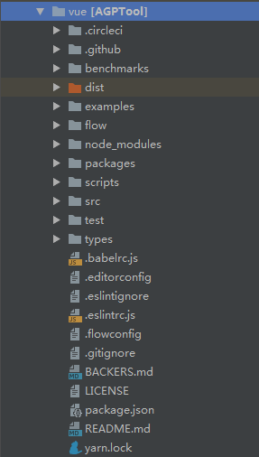
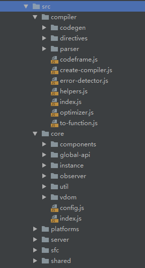

## vue 简介
* Vue (读音 /vjuː/，类似于 view) 是一套用于构建用户界面的渐进式框架。

## vue 源码结构
* 我们使用git工具下载最新的vue源码([https://github.com/vuejs/vue.git](https://github.com/vuejs/vue.git))。 目前最新的版本2.6.10，后面的代码分析都使用该版本。 

* 我们先大致看一下vue项目的目录结构： 

 

* 对目录的一些简要说明如下： 

```
├ benchmarks // 静态资源目录
├ dist       // 打包后的文件目录
├ examples   // 功能示例目录
├ flow       // flow声明文件目录
├ packages   // 包目录
├ scripts    // 一些命令目录 
├ src        // 功能源码目录 
├ test       // 代码测试目录
└ types      // types类型文件目录 
``` 

* 其中我们重点要分析的就是src源码目录代码和examples示例目录代码。

## vue 解析要点
* 这里我们只看vue项目的src源码目录： 

 

* 对目录文件的一些简要说明如下： 

```
src
├ compiler    //编译器目录
│   ├ codegen            //
│   ├ directives         //
│   ├ parser             //
│   ├ codeframe.js       //
│   ├ create-compiler.js //
│   ├ error-detector.js  //
│   ├ helpers.js         //
│   ├ index.js           //
│   ├ optimizer.js       //
│   └ to-function.js     //
│
├ core        //核心功能目录
│   ├ components    //全局组件相关，这里只有keep-alive
│   ├ global-api    //全局方法定义，比如Vue.use、Vue.extend、Vue.mixin等
│   ├ instance      //实例相关内容，包括实例方法，生命周期，事件等
│   ├ observer      //数据绑定相关
│   ├ util          //工具方法相关
│   ├ vdom          //虚拟dom相关
│   ├ config.js     //
│   └ index.js      //实例化vue入口，看源码从这里开始
│
├─ platforms //各个平台运行目录
│
├─ server    //服务端渲染目录
│
├─ sfc       //SFC文件解析目录
│    └─ parser.js     //单文件*.vue解析逻辑
│
└─ shared    //共享工具函数、变量目录
     ├─ constants.js  //共享变量
     └─ util.js       //共享工具函数
```
